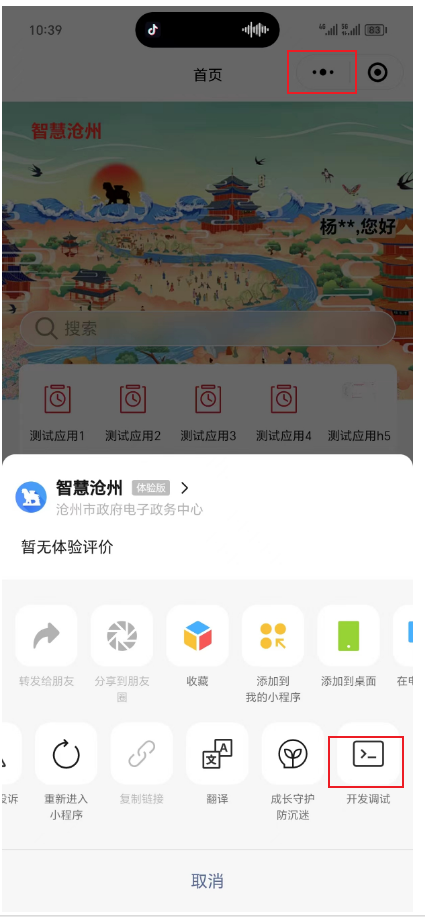

# 体验版本测试

## 1.需要提供测试人员的微信，添加成为体验者。

## 2.未配置校验文件时，需要打开开发调试。

### 扫码进入h5的测试：

提供测试链接。微信小程序后台配置地址才能打开体验版的小程序。

	示例：http://qr.smartcangzhou.cn?redirect=[redirect_id]&param1=''&param2=''

### 其他测试无需其他配置，直接在体验版本测试即可。
